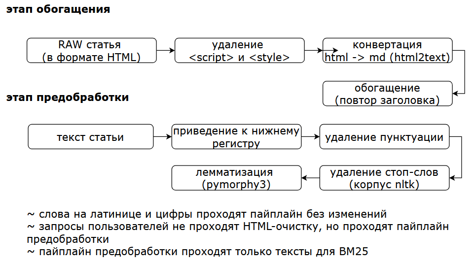
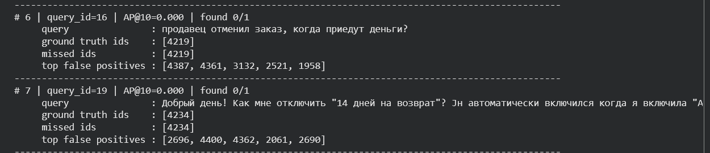

# RAG Help Center Search Engine
В этой задаче нужно решить этап поиска: по тексту вопроса пользователя найти статьи, которые стоит передать дальше в пайплайн.

Двухэтапный гибридный пайплайн (Hybrid Search + Cross-Encoder Reranking) для поиска релевантных статей справочного центра по вопросам пользователей.


## Результаты и валидация
| Подход | MAP@10 | Особенности |
| :--- | :---: | :--- |
| **Baseline** | **0,3105** | Базовый пайплайн поиска. |

анализ:
1. базовая модель цепляется за популярные слова (типа «Авито», «доставка», «деньги»), из-за чего валит в кучу совершенно разные по смыслу запросы.  
**пример:** на query_id=6, 7 и 14: пользователи спрашивают, почему доставка дорогая или почему цена изменилась; правильный ответ - статья 1951; текущий ответ - статьи 4532, 4361, 4234, которые просто содержат слово «доставка».  
**гипотеза:** при поиске сдвинуть баланс с BM25 в сторону эмбеддингов


## Setup
Убедитесь, что у вас установлен [uv](https://github.com/astral-sh/uv).

```bash
uv sync
uv run pre-commit install
```

## Запуск проекта
Пайплайн полностью автоматизирован и выполняется внутри единого контекста в main.py. Код самостоятельно управляет жизненным циклом индексов и стадиями обработки.

Для запуска пайплайна выполните команду в терминале:

```bash
export PYTHONUTF8=1  # в Windows cmd: set PYTHONUTF8=1
# запуск решения
uv run main.py

# текстовый отчет об ошибках на calibration.f
uv run python -m src.analysis

# запуск локального дашборда phoenix для анализа ошибок
uv run python -m src.launch_dashboard

# выводит на экран текст после этапа обогащения
uv run python -m src.inspect_article <id>
```

## Данные
Для работы пайплайна необходимы [три файла](https://www.dropbox.com/scl/fi/v5hheavft3kw800kpabex/candidate_public.zip?rlkey=aalce34t5eohri4atk5fur1r4&st=2y96nmvt&dl=1) в формате Feather:

- `articles.f` — база статей справки  
`article_id` — целочисленный идентификатор статьи;  
`title` — заголовок статьи;  
`body` — текст статьи в HTML.

- `calibration.f` — размеченные запросы для локальной проверки подхода  
`query_id` — идентификатор запроса,  
`query_text` — текст вопроса пользователя,  
`ground_truth` — правильные `article_id`, разделённые пробелами.

- `test.f` — запросы, для которых нужно подготовить ответ  
`query_id` — идентификатор запроса,  
`query_text` — текст вопроса пользователя.

## Метрика

Решения оцениваются по `MAP@10`.

Для одного запроса считается `AP@10`: чем выше в списке стоят релевантные документы, тем больше их вклад. Затем значение усредняется по всем запросам.

Если для запроса есть несколько правильных статей, в оценке учитываются все найденные документы, а не только первый.

## Что происходит при запуске:
   1. предобработка и очистка HTML;
   2. если файлы индексов отсутствуют в data/, автоматически строятся два индекса: лексический (`BM25Okapi`) и векторный семантический (FAISS на модели `paraphrase-multilingual-MiniLM-L12-v2`);
   3. скрипт делает предсказания для calibration.f, вычисляет точную метрику MAP@10 и выводит её значение в консоль;
   4. происходит пакетный расчет ответов для test.f. для каждого запроса каждый ретривер (BM25 и FAISS) извлекает по 100 кандидатов (`top_k_candidates`), списки объединяются через RRF, и топ-15 объединённого пула (`reranker.rerank_depth`) переранжируется `BAAI/bge-reranker-v2-m3`. итоговый топ-10 сохраняется в файл answer.csv в корне проекта.

## примечания
* при первом старте библиотеки автоматически скачают веса эмбеддера и реранкера с Hugging Face в кэш;
* пути к данным прописаны в config.yaml.
